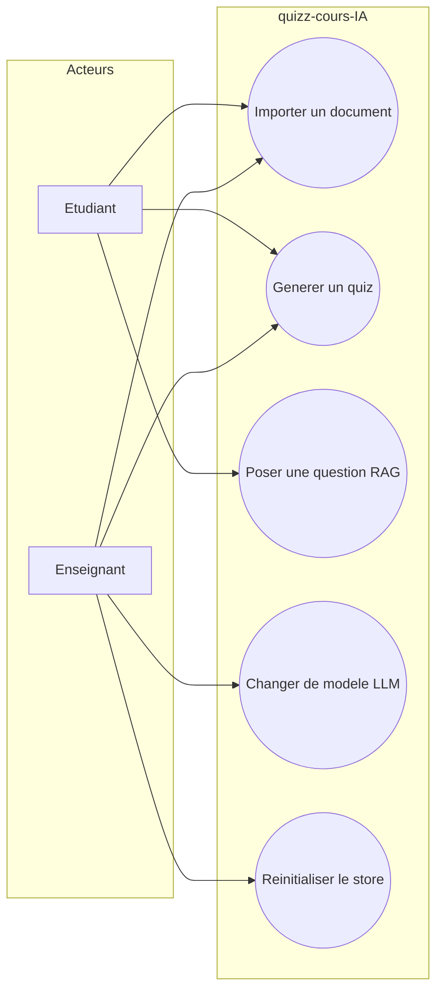
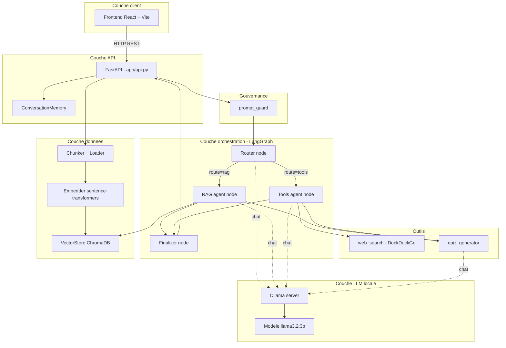
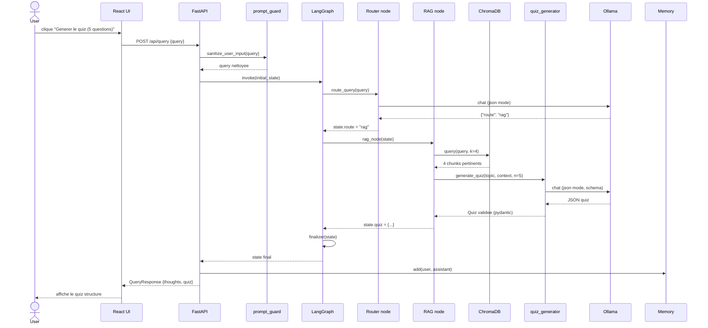
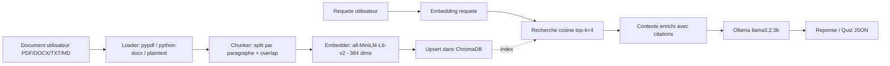
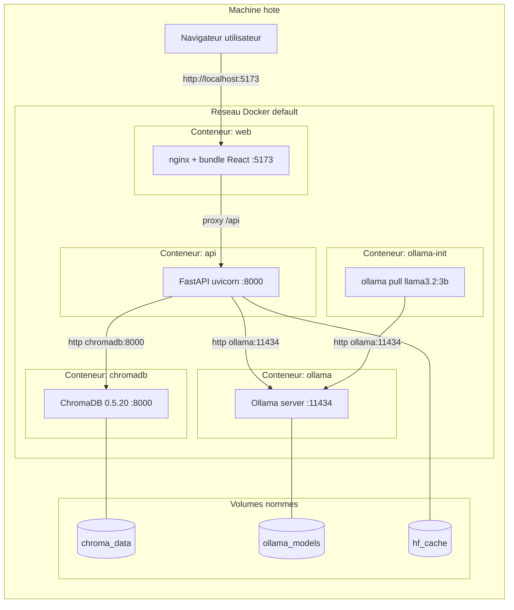

# Architecture — quizz-cours-IA

Ce document décrit l'architecture technique de l'application au travers de
plusieurs diagrammes complémentaires : cas d'utilisation, composants logiques,
flux RAG, séquence d'exécution et déploiement conteneurisé.

---

## 1. Diagramme de cas d'utilisation

**Acteurs et besoins** :

- **Enseignant** : prépare des quiz d'évaluation à partir de ses supports.
- **Étudiant** : s'auto-évalue et pose des questions ciblées sur ses cours.

---

## 2. Diagramme de composants

**Lecture du diagramme** : les flèches pleines représentent les flux
fonctionnels, les pointillés représentent les appels LLM (transverses).
Tous les nœuds d'orchestration peuvent appeler Ollama via la même interface
`OllamaClient.chat()`.

---

## 3. Diagramme de séquence — génération d'un quiz

---

## 4. Diagramme de flux RAG

**Détails techniques** :

- Taille de chunk par défaut : ~800 caractères avec overlap de 100
- Distance : cosine, normalisée en score `1 - distance`
- Métadonnées indexées : `source` (nom fichier) et `page` (numéro)
- Top-k=4 pour équilibrer rappel et budget de tokens

---

## 5. Diagramme de déploiement (conteneurs Docker)

**Ports exposés sur l'hôte** :

| Service | Port hôte | Port conteneur | Usage |
|---|---|---|---|
| web | 5173 | 5173 | UI utilisateur |
| api | 8000 | 8000 | API REST + Swagger |
| ollama | 11434 | 11434 | Debug / `ollama pull` manuel |
| chromadb | — | 8000 | Non exposé, accès interne uniquement |

**Volumes persistants** :

- `chroma_data` : index vectoriel ChromaDB (re-créé à chaque `/api/reset`)
- `ollama_models` : modèles téléchargés (~2 Go pour llama3.2:3b)
- `hf_cache` : modèles d'embeddings HuggingFace (~90 Mo)

---

## 6. Cycle de vie complet d'une requête

1. L'utilisateur saisit une requête dans l'UI (ou le CLI).
2. Le frontend `POST /api/query` ; FastAPI passe la requête par
   `prompt_guard.sanitize_user_input()` (réécriture des motifs d'injection).
3. Le graphe LangGraph est invoqué avec un `initial_state` contenant la
   requête nettoyée et l'historique des N derniers tours.
4. **Router** : analyse heuristique (tokens) puis LLM en tie-breaker si
   ambigu. Écrit `state["route"]` ∈ {`"rag"`, `"tools"`}.
5. **RAG path** (`route == "rag"`) :
   - `VectorStore.query()` retourne les top-k chunks (k=4) avec leurs
     métadonnées de source.
   - Si la requête contient un mot-clé quiz → délégation à `quiz_generator`
     avec un contexte ancré dans les chunks.
   - Sinon → réponse textuelle avec citations `[Source: fichier, page: N]`.
6. **Tools path** (`route == "tools"`) :
   - Décision LLM : faut-il une recherche web ? (heuristique +
     `use_web` JSON).
   - Si oui → `web_search` DuckDuckGo, sinon utilisation des connaissances
     internes du modèle.
   - Délégation éventuelle à `quiz_generator` avec les snippets web.
7. **Finalizer** : formate la sortie (texte ou quiz structuré) et accumule
   les `thoughts` (Routeur, RAG/Outils, Final).
8. La mémoire conversationnelle (`ConversationMemory`) enregistre l'échange
   et garantit la fenêtre des `MAX_HISTORY_TURNS` derniers tours.
9. La réponse JSON `QueryResponse` est retournée à l'UI qui affiche le quiz
   structuré et les étapes de raisonnement.

---

## 7. Décisions d'architecture (ADR résumés)

| Décision | Alternative écartée | Justification |
|---|---|---|
| LangGraph plutôt que chaîne LangChain | LangChain `SequentialChain` | Routage conditionnel natif, état typé, traçabilité par nœud |
| Ollama plutôt que llama.cpp embarqué | `llama-cpp-python` | Service séparé → couplage faible, modèles partagés entre conteneurs |
| ChromaDB plutôt que Qdrant | Qdrant, Weaviate | API simple, fallback PersistentClient sans serveur |
| sentence-transformers local plutôt que API embeddings | OpenAI / Cohere | Zéro dépendance cloud, conforme à l'exigence locale |
| pydantic v2 pour les sorties LLM | Validation manuelle JSON | Garanties de schéma, messages d'erreur exploitables pour retry |
| FastAPI plutôt que Flask | Flask | Validation automatique, OpenAPI gratuit, async-ready |

---

## 8. Limites connues et évolutions

**Limites actuelles** :

- Pipeline mono-document : chaque import remplace le corpus (par design)
- Pas de streaming des réponses (latence perçue plus élevée sur petits modèles)
- Pas de cache de requêtes : deux générations identiques re-paient le LLM

**Évolutions identifiées** :

- Multi-corpus avec sélection au moment de la requête
- Streaming SSE vers le frontend pour afficher les tokens à la volée
- Cache LRU des couples (query, top-k chunks) pour les démos
- Export PDF/Markdown du quiz généré
